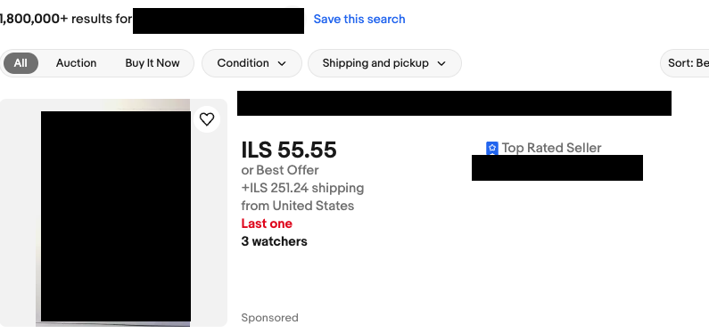
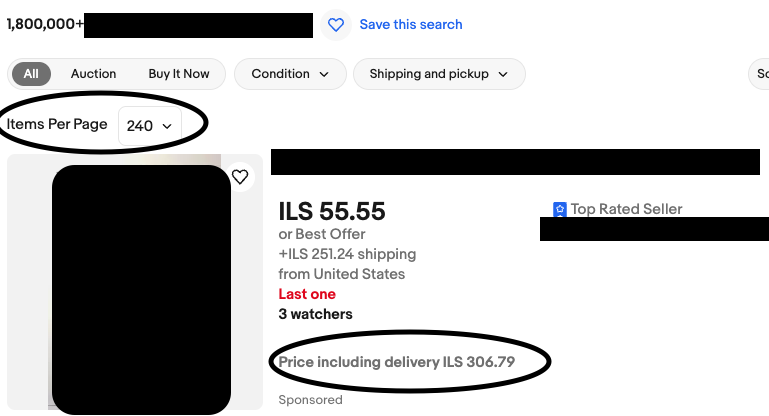

## Simple Utility Chrome Extension for Ebay

### What does it do ?
1. When used, the extension will add the combined delivery and item prices for each of the items returned when displaying the results page after searching for items.
2. Will move the results per page selector to be at the top of the results page, instead of being in the bottom of it.

#### Before

#### After

3. Pressing the mouse **scroll** button the item image will be rotated 90 degress clockwise (when in the item screen).

4. Pressing the **b** button will save the current page as bookmark under a folder called **EBay** and under a subfolder for that seller.

#### [How to add local Chrome Extensions](https://developer.chrome.com/docs/extensions/get-started/tutorial/hello-world#load-unpacked)